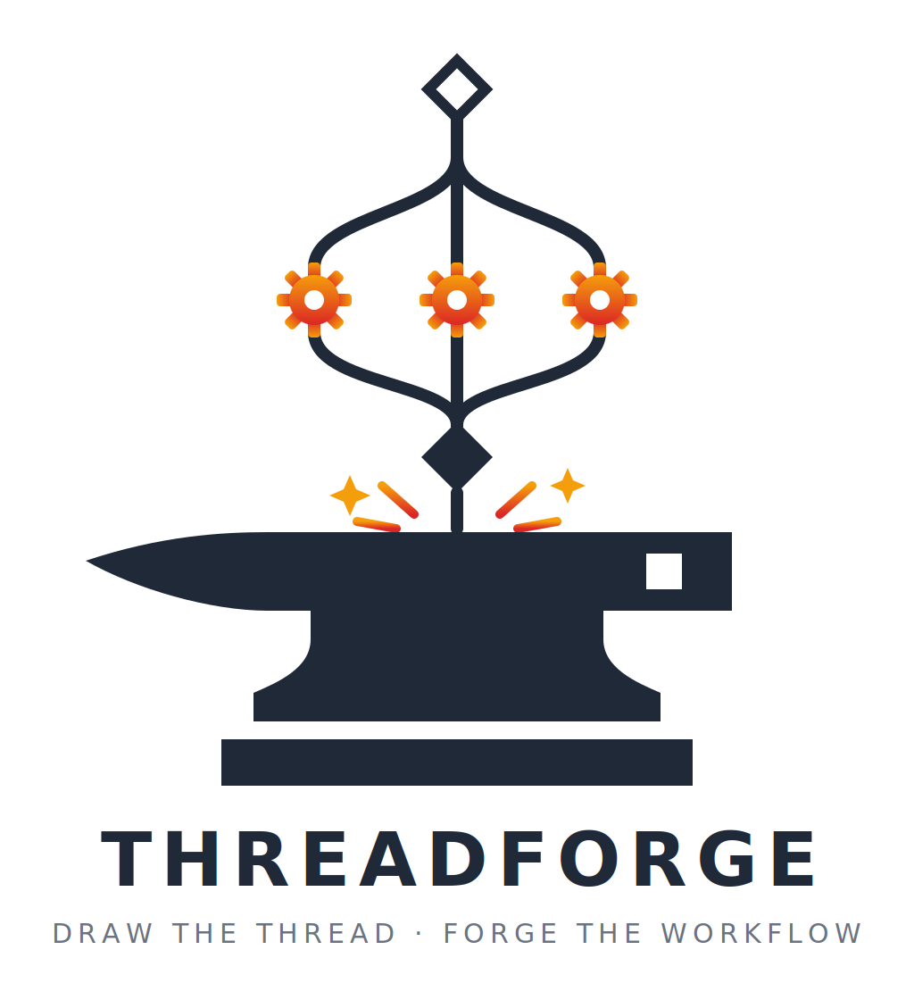
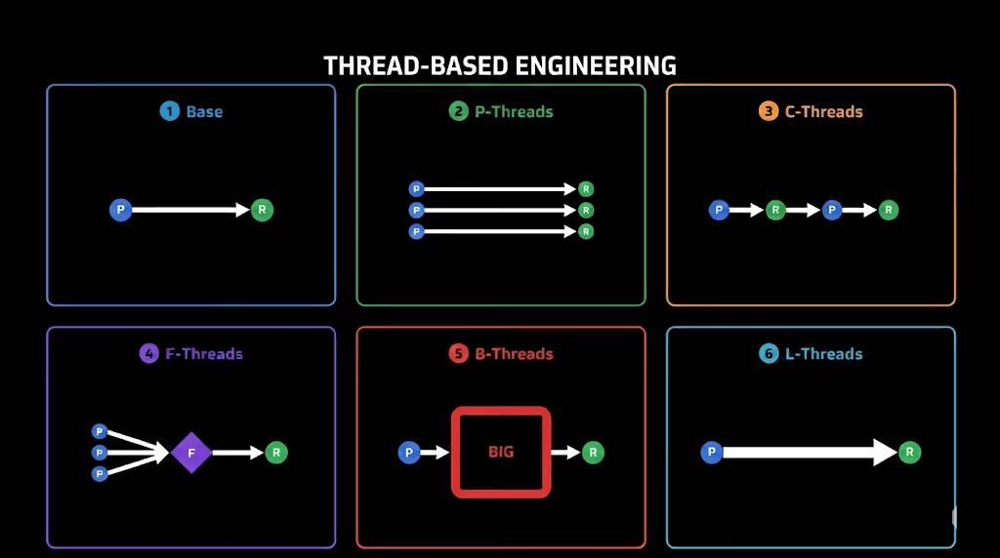
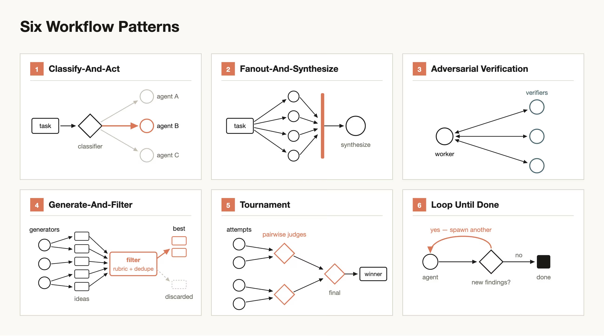

# ThreadForge

<p align="center"></p>

**Draw the topology of engineering work as a thread. Let your agent write the workflow code.**

ThreadForge is an [agent skill](https://agentskills.io) that turns a prose request like *"verify
every story on my Jira board against its acceptance criteria"* into a
**[thread](https://claudefa.st/blog/guide/mechanics/thread-based-engineering)** and a
**[dynamic workflow](https://code.claude.com/docs/en/workflows)**

## Where this comes from

1. **[Thread-Based Engineering](https://claudefa.st/blog/guide/mechanics/thread-based-engineering)**
is the source model. A thread is *"a unit of engineering work over time, driven by you and your
agent"* — with two mandatory human touchpoints: you begin it (prompt or plan) and you end it (review
or validate). Everything between is agent work.

<p align="center">
  <a href="https://claudefa.st/blog/guide/mechanics/thread-based-engineering">
    
  </a>
  <br><sub>The six thread types — diagram from the <a href="https://claudefa.st/blog/guide/mechanics/thread-based-engineering">Thread-Based Engineering guide</a></sub>
</p>

2. **[Dynamic Workflows](https://claudefa.st/blog/guide/development/dynamic-workflows)** is the target
layer. Workflows are *"the orchestration layer for everything multi-agent,"* sitting **beneath** the
thread model — which is exactly the boundary ThreadForge builds on: you author at the thread layer
(strategy), the skill generates the orchestration layer beneath it (mechanism). You never hand-write
`pipeline()` vs `parallel()` again, and when the runtime grows new primitives, your threads don't
change — you regenerate.

<p align="center">
  <a href="https://claudefa.st/blog/guide/development/dynamic-workflows">
    
  </a>
  <br><sub>The six workflow patterns — diagram from the <a href="https://claudefa.st/blog/guide/development/dynamic-workflows">Dynamic Workflows guide</a>; ThreadForge ships each as a <a href="docs/templates/">ready-to-edit template</a></sub>
</p>

Workflows are *"powerful and expensive"* — *"wasteful for a two-line bug fix,"* and most traditional coding tasks don't need a
panel of five reviewers. Read [when *not* to use a workflow](https://claudefa.st/blog/guide/development/dynamic-workflows#when-not-to-use-a-workflow)
before drawing your first thread: if a single agent can hold the whole task in one context window,
you don't need a thread — just ask your agent. ThreadForge is for the work that's *"too big, too
parallel, or too prone to self-grading for one context window to handle."*

## Install

```bash
# into the current project (recommended — threads belong in the repo)
npx skills add Sarps/threadforge

# or globally, for every project
npx skills add Sarps/threadforge -g
```

Works with Claude Code and [60+ other agents](https://github.com/vercel-labs/skills#supported-agents)
via the `skills` CLI. Authoring/validation/rendering work anywhere; *executing* generated workflows
requires an agent with the dynamic-workflows runtime (Claude Code).

## Use

Just ask your agent:

- **"Make me a workflow that audits every route handler for missing auth checks"** → template →
  interview → thread → diagram → your approval → script
- **"Show me what verify-jira-stories does"** → renders the diagram (never dumps JS at you)
- **"Change it to also check unit test coverage per story"** → edits the thread, re-validates,
  re-renders, regenerates
- **"The workflow runtime got new primitives — regenerate everything"** → threads are stable;
  scripts are disposable
- **"Turn my existing hand-written workflow into a thread"** → decompile

## Why a thread, not just a prompt?

A vague prompt can't fail. A thread can:

```text
ERROR  $.root.steps[0].over
       fans out over "epics" but nothing in scope produces it (in scope: nothing)
ERROR  $.root.steps[1].barrierReason
       parallel requires barrierReason: why must a later step see ALL branch results at once?
ERROR  $.root.steps[2].stopCondition
       loop requires stopCondition: when is it done? An unbounded loop is a vague loop
```

The schema's required fields are exactly the things vague prompts leave unsaid. The skill interviews
you until they're pinned, and refuses to write code until validation passes and you've approved the
diagram.

## What's in the skill

```text
skills/threadforge/
  SKILL.md                        the protocol (interview → validate → render → approve → codegen)
  scripts/validate-thread.mjs     deterministic structural validation (no deps, Node ≥ 16)
  scripts/render-thread.mjs       deterministic thread → Mermaid rendering (no deps)
  references/thread-schema.json   the thread JSON Schema
  references/codegen-contract.md  the rules every generated script must satisfy
  references/worked-example.md    a full thread → diagram → script chain, annotated
  templates/                      10 starting shapes: C/P/B/F thread types + six workflow patterns
```

Rendered diagrams for every template: [docs/templates/](docs/templates/).

## License

MIT
