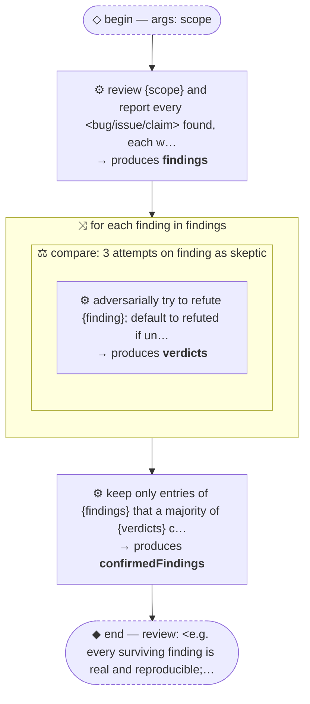

# Thread: template-adversarial-verification

> TEMPLATE (pattern, B + F): produce findings, then per finding fan out independent skeptics who try to REFUTE it; keep only survivors. Rename meta.name, then replace every &lt;placeholder&gt;.

**This document is generated from the thread JSON — edit the thread, then re-render. Do not edit by hand.**

## Handoffs

| name | produced by |
| --- | --- |
| `findings` | review {scope} and report every &lt;bug/issue/clai… |
| `verdicts` | adversarially try to refute {finding}; default … |
| `confirmedFindings` | keep only entries of {findings} that a majority… |

## Human nodes

- **begin:** args `{"scope":"string (required) — <what to review, e.g. a diff, directory, or document>"}`
- **end (review):** &lt;e.g. every surviving finding is real and reproducible; the kill list looks reasonable&gt;

Workflow artifact: `.claude/workflows/template-adversarial-verification.js`

