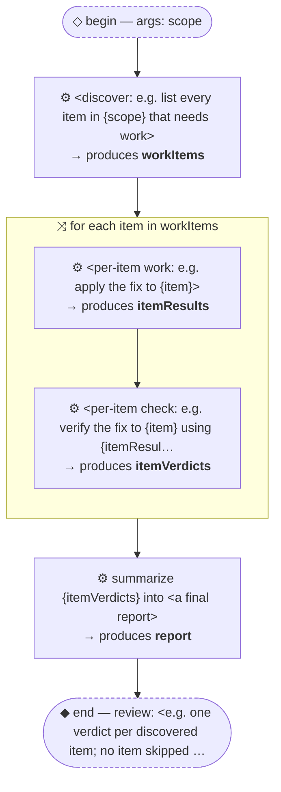

# Thread: template-b-nested-orchestration

> TEMPLATE (B — nested orchestration): discover a list of items, then run a sub-thread per item. Rename meta.name, then replace every &lt;placeholder&gt;.

**This document is generated from the thread JSON — edit the thread, then re-render. Do not edit by hand.**

## Handoffs

| name | produced by |
| --- | --- |
| `workItems` | &lt;discover: e.g. list every item in {scope} that… |
| `itemResults` | &lt;per-item work: e.g. apply the fix to {item}&gt; |
| `itemVerdicts` | &lt;per-item check: e.g. verify the fix to {item} … |
| `report` | summarize {itemVerdicts} into &lt;a final report&gt; |

## Human nodes

- **begin:** args `{"scope":"string (required) — <where to discover items, e.g. a directory or board>"}`
- **end (review):** &lt;e.g. one verdict per discovered item; no item skipped silently&gt;

Workflow artifact: `.claude/workflows/template-b-nested-orchestration.js`

