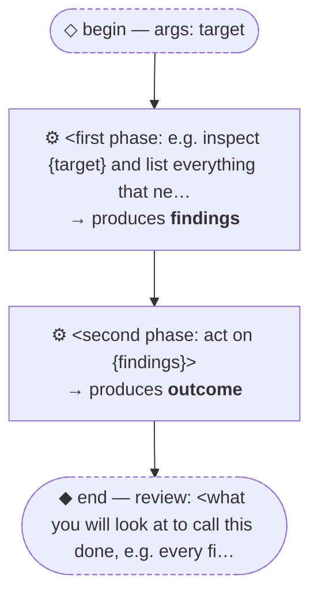

# Thread: template-c-sequential

> TEMPLATE (C — chained/sequential): phases in order with a named handoff between them. Rename meta.name, then replace every &lt;placeholder&gt;.

**This document is generated from the thread JSON — edit the thread, then re-render. Do not edit by hand.**

## Handoffs

| name | produced by |
| --- | --- |
| `findings` | &lt;first phase: e.g. inspect {target} and list ev… |
| `outcome` | &lt;second phase: act on {findings}&gt; |

## Human nodes

- **begin:** args `{"target":"string (required) — <what the work runs against, e.g. a path or ticket id>"}` — &lt;why this thread is being run&gt;
- **end (review):** &lt;what you will look at to call this done, e.g. every finding addressed or explicitly skipped with a reason&gt;

Workflow artifact: `.claude/workflows/template-c-sequential.js`

