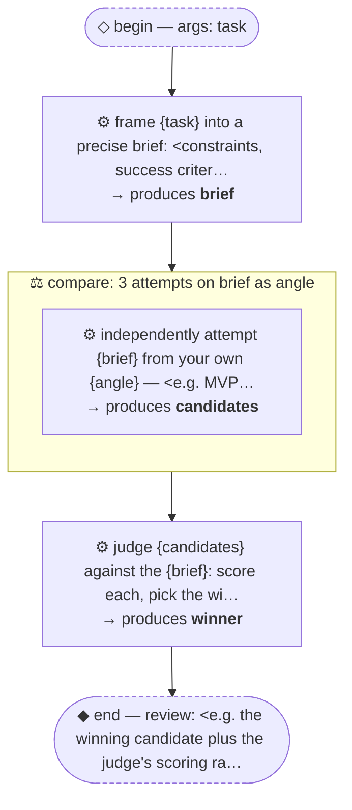

# Thread: template-f-fanout-compare

> TEMPLATE (F — fan-out comparative): N independent attempts at the same work, then a judge picks/synthesizes the winner. Rename meta.name, then replace every &lt;placeholder&gt;.

**This document is generated from the thread JSON — edit the thread, then re-render. Do not edit by hand.**

## Handoffs

| name | produced by |
| --- | --- |
| `brief` | frame {task} into a precise brief: &lt;constraints… |
| `candidates` | independently attempt {brief} from your own {an… |
| `winner` | judge {candidates} against the {brief}: score e… |

## Human nodes

- **begin:** args `{"task":"string (required) — <the work every attempt takes on>"}`
- **end (review):** &lt;e.g. the winning candidate plus the judge's scoring rationale&gt;

Workflow artifact: `.claude/workflows/template-f-fanout-compare.js`

