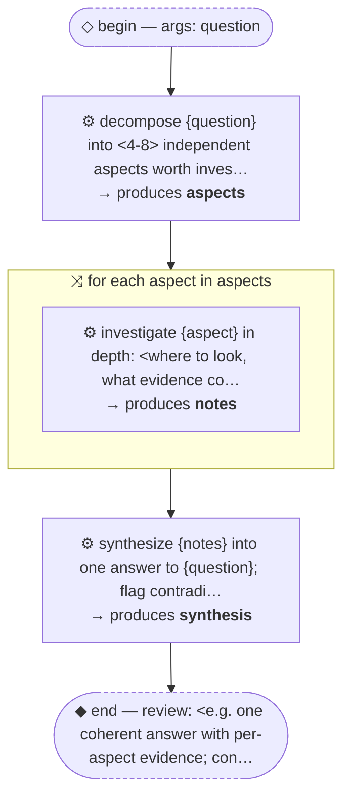

# Thread: template-fanout-and-synthesize

> TEMPLATE (pattern, B + barrier): break a question into aspects, research each in parallel, synthesize one answer. Rename meta.name, then replace every &lt;placeholder&gt;.

**This document is generated from the thread JSON — edit the thread, then re-render. Do not edit by hand.**

## Handoffs

| name | produced by |
| --- | --- |
| `aspects` | decompose {question} into &lt;4-8&gt; independent asp… |
| `notes` | investigate {aspect} in depth: &lt;where to look, … |
| `synthesis` | synthesize {notes} into one answer to {question… |

## Human nodes

- **begin:** args `{"question":"string (required) — <the thing to understand>"}`
- **end (review):** &lt;e.g. one coherent answer with per-aspect evidence; contradictions surfaced, not averaged away&gt;

Workflow artifact: `.claude/workflows/template-fanout-and-synthesize.js`

