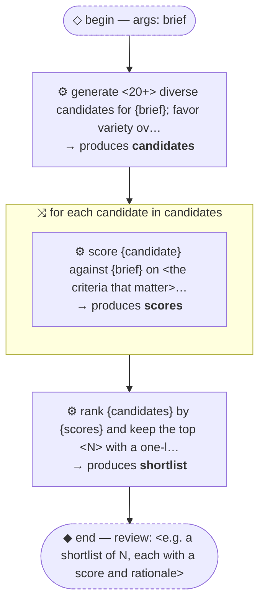

# Thread: template-generate-and-filter

> TEMPLATE (pattern): generate many candidates cheaply, score each independently, keep the best. Rename meta.name, then replace every &lt;placeholder&gt;.

**This document is generated from the thread JSON — edit the thread, then re-render. Do not edit by hand.**

## Handoffs

| name | produced by |
| --- | --- |
| `candidates` | generate &lt;20+&gt; diverse candidates for {brief}; … |
| `scores` | score {candidate} against {brief} on &lt;the crite… |
| `shortlist` | rank {candidates} by {scores} and keep the top … |

## Human nodes

- **begin:** args `{"brief":"string (required) — <what to generate and the constraints>"}`
- **end (review):** &lt;e.g. a shortlist of N, each with a score and rationale&gt;

Workflow artifact: `.claude/workflows/template-generate-and-filter.js`

