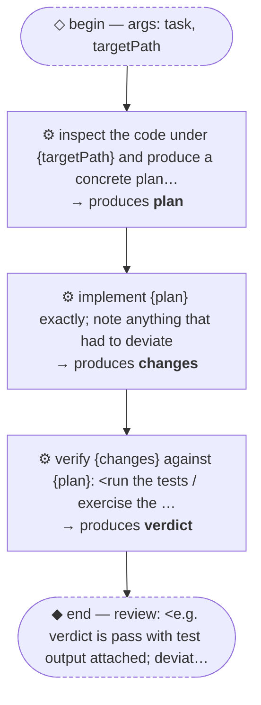

# Thread: template-inspect-implement-verify

> TEMPLATE (pattern, C-shaped): inspect the code, implement against the plan, verify the result. Rename meta.name, then replace every &lt;placeholder&gt;.

**This document is generated from the thread JSON — edit the thread, then re-render. Do not edit by hand.**

## Handoffs

| name | produced by |
| --- | --- |
| `plan` | inspect the code under {targetPath} and produce… |
| `changes` | implement {plan} exactly; note anything that ha… |
| `verdict` | verify {changes} against {plan}: &lt;run the tests… |

## Human nodes

- **begin:** args `{"task":"string (required) — <the change to make>","targetPath":"string — <where in the repo, default src/>"}`
- **end (review):** &lt;e.g. verdict is pass with test output attached; deviations from plan are listed and acceptable&gt;

Workflow artifact: `.claude/workflows/template-inspect-implement-verify.js`

