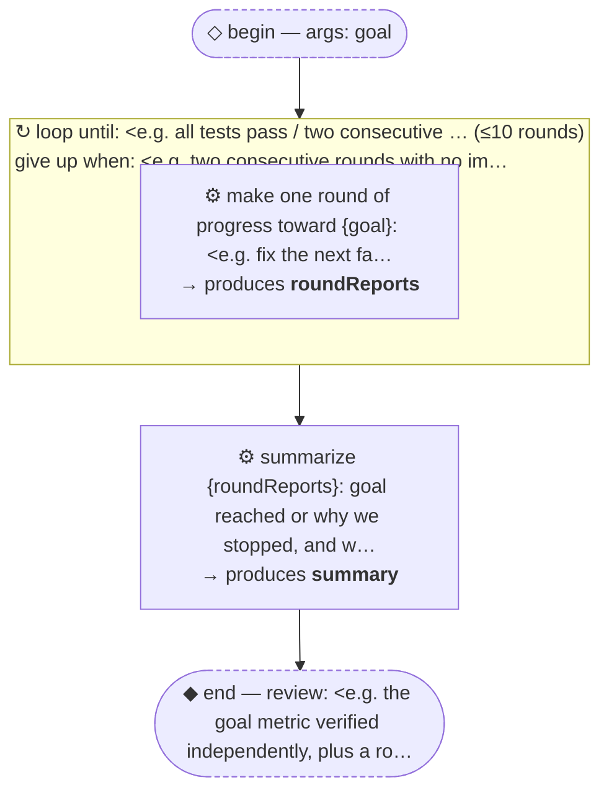

# Thread: template-loop-until-done

> TEMPLATE (pattern): repeat a unit of work until a goal condition holds or progress stalls. Rename meta.name, then replace every &lt;placeholder&gt;.

**This document is generated from the thread JSON — edit the thread, then re-render. Do not edit by hand.**

## Handoffs

| name | produced by |
| --- | --- |
| `roundReports` | make one round of progress toward {goal}: &lt;e.g.… |
| `summary` | summarize {roundReports}: goal reached or why w… |

## Human nodes

- **begin:** args `{"goal":"string (required) — <the condition that ends the loop, checkable by an agent>"}`
- **end (review):** &lt;e.g. the goal metric verified independently, plus a round-by-round trail&gt;

Workflow artifact: `.claude/workflows/template-loop-until-done.js`

