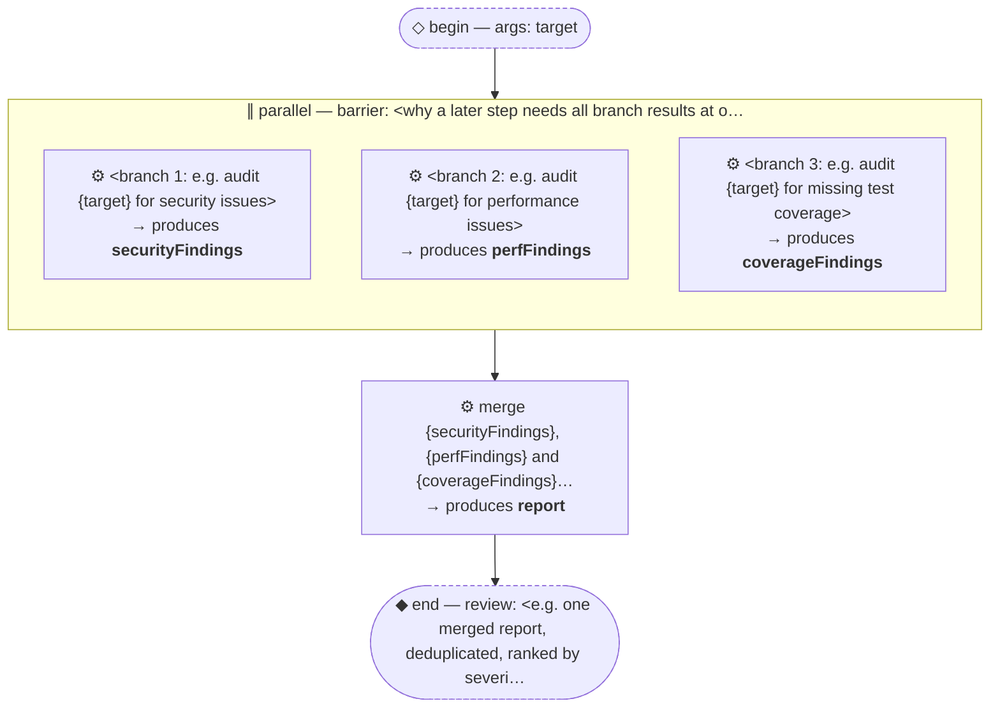

# Thread: template-p-parallel-barrier

> TEMPLATE (P — parallel + barrier): fixed branches run at once, then a step that needs ALL their results together. Rename meta.name, then replace every &lt;placeholder&gt;.

**This document is generated from the thread JSON — edit the thread, then re-render. Do not edit by hand.**

## Handoffs

| name | produced by |
| --- | --- |
| `securityFindings` | &lt;branch 1: e.g. audit {target} for security iss… |
| `perfFindings` | &lt;branch 2: e.g. audit {target} for performance … |
| `coverageFindings` | &lt;branch 3: e.g. audit {target} for missing test… |
| `report` | merge {securityFindings}, {perfFindings} and {c… |

## Human nodes

- **begin:** args `{"target":"string (required) — <what all branches examine>"}`
- **end (review):** &lt;e.g. one merged report, deduplicated, ranked by severity&gt;

Workflow artifact: `.claude/workflows/template-p-parallel-barrier.js`

