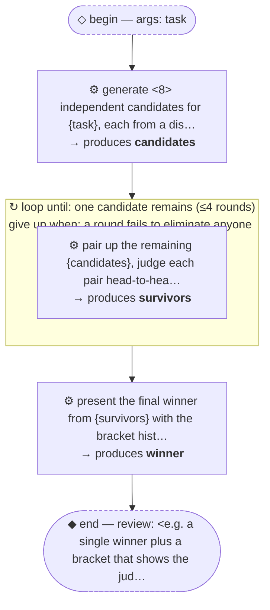

# Thread: template-tournament

> TEMPLATE (pattern, F + bracket): generate candidates, then judge them head-to-head in elimination rounds until one remains. Rename meta.name, then replace every &lt;placeholder&gt;.

**This document is generated from the thread JSON — edit the thread, then re-render. Do not edit by hand.**

## Handoffs

| name | produced by |
| --- | --- |
| `candidates` | generate &lt;8&gt; independent candidates for {task},… |
| `survivors` | pair up the remaining {candidates}, judge each … |
| `winner` | present the final winner from {survivors} with … |

## Human nodes

- **begin:** args `{"task":"string (required) — <what the candidates compete on>"}`
- **end (review):** &lt;e.g. a single winner plus a bracket that shows the judging was real&gt;

Workflow artifact: `.claude/workflows/template-tournament.js`

