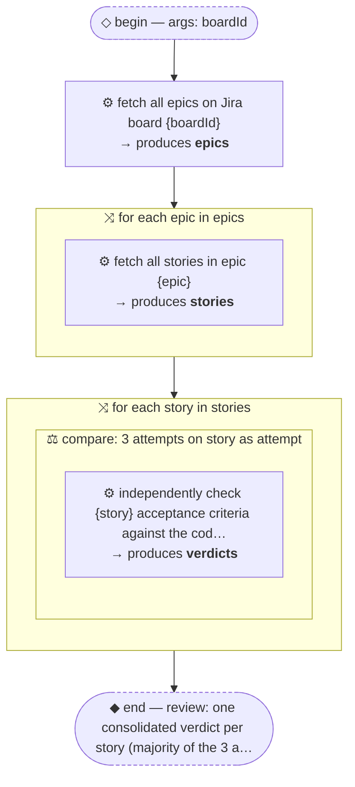

# Worked Example: verify-jira-stories

The full artifact chain for one thread: the engineer draws the thread, the tool renders the diagram,
the codegen agent writes the script. Use this as the canonical few-shot example when generating.

The engineer's intent: *verify that every story on a Jira board is actually implemented against its
acceptance criteria*, with three independent verifiers per story to keep any single verifier's
optimism out of the verdict.

## 1. The thread — `threads/verify-jira-stories.thread.json`

```json
{
  "schemaVersion": "1",
  "meta": {
    "name": "verify-jira-stories",
    "description": "Verify every story on a Jira board is implemented per its acceptance criteria",
    "whenToUse": "Before a release or sprint review, to audit a board's stories against the actual code"
  },
  "begin": {
    "args": { "boardId": "string (required)" },
    "intent": "Audit implementation completeness for a whole board"
  },
  "root": {
    "kind": "sequence",
    "steps": [
      {
        "kind": "agent",
        "does": "fetch all epics on Jira board {boardId}",
        "produces": "epics"
      },
      {
        "kind": "fanout",
        "mode": "orchestrate",
        "over": "epics",
        "as": "epic",
        "body": {
          "kind": "agent",
          "does": "fetch all stories in epic {epic}",
          "produces": "stories"
        }
      },
      {
        "kind": "fanout",
        "mode": "orchestrate",
        "over": "stories",
        "as": "story",
        "body": {
          "kind": "fanout",
          "mode": "compare",
          "over": "story",
          "as": "attempt",
          "agents": 3,
          "body": {
            "kind": "agent",
            "does": "independently check {story} acceptance criteria against the code and report pass/fail per criterion",
            "produces": "verdicts"
          }
        }
      }
    ]
  },
  "end": {
    "review": "one consolidated verdict per story (majority of the 3 attempts), grouped by epic, with failing criteria listed"
  }
}
```

## 2. The rendered view — `threads/verify-jira-stories.md` (via `render-thread.mjs --doc`)



## 3. The generated workflow — `.claude/workflows/verify-jira-stories.js`

Codegen decisions to notice, each traceable to the contract:

- both orchestrate fan-outs become one `pipeline()` chain — an epic's stories are verified while
  other epics are still being fetched; no barrier was declared between epics, so none exists (C3)
- the compare fanout becomes `parallel()` — the majority vote genuinely needs all 3 attempts (C3)
- every consumed handoff got a schema; `stories` carries `acceptanceCriteria` because the verify
  prompt needs it (C4)
- the two-word `does` lines became self-contained prompts carrying the specific fields downstream
  agents need — not `JSON.stringify` of whole objects (C6)
- the return shape is literally `end.review`: verdicts grouped by epic, majority-consolidated, with
  failing criteria — plus counts so silent gaps show (C9)
- read-only audit → no worktree isolation anywhere (C7)

```js
export const meta = {
  name: 'verify-jira-stories',
  description: 'Verify every story on a Jira board is implemented per its acceptance criteria',
  whenToUse: "Before a release or sprint review, to audit a board's stories against the actual code",
  phases: [
    { title: 'Discover', detail: 'fetch epics and their stories from Jira' },
    { title: 'Verify', detail: '3 independent checks per story, majority vote' },
  ],
}

const EPICS = {
  type: 'object',
  required: ['epics'],
  properties: {
    epics: {
      type: 'array',
      items: {
        type: 'object',
        required: ['key', 'title'],
        properties: { key: { type: 'string' }, title: { type: 'string' } },
      },
    },
  },
}

const STORIES = {
  type: 'object',
  required: ['stories'],
  properties: {
    stories: {
      type: 'array',
      items: {
        type: 'object',
        required: ['key', 'title', 'acceptanceCriteria'],
        properties: {
          key: { type: 'string' },
          title: { type: 'string' },
          acceptanceCriteria: { type: 'array', items: { type: 'string' } },
        },
      },
    },
  },
}

const VERDICT = {
  type: 'object',
  required: ['pass', 'criteria'],
  properties: {
    pass: { type: 'boolean' },
    criteria: {
      type: 'array',
      items: {
        type: 'object',
        required: ['criterion', 'met'],
        properties: {
          criterion: { type: 'string' },
          met: { type: 'boolean' },
          evidence: { type: 'string' },
        },
      },
    },
    notes: { type: 'string' },
  },
}

const boardId = args?.boardId
if (!boardId) throw new Error('boardId required')

phase('Discover')
const discovered = await agent(
  `Fetch all epics on Jira board ${boardId} using the Atlassian tools. Return every epic's key and title.`,
  { label: 'fetch-epics', schema: EPICS },
)
const epics = discovered.epics
log(`${epics.length} epics on board ${boardId}`)

// One pipeline chain per epic: fetch stories, then verify each story with a
// 3-attempt majority vote. No barrier between epics, so no parallel() at this level.
const byEpic = await pipeline(
  epics,
  epic =>
    agent(
      `Fetch all stories in Jira epic ${epic.key} ("${epic.title}"). For each story return its key, title, and the full text of each acceptance criterion.`,
      { label: `stories:${epic.key}`, phase: 'Discover', schema: STORIES },
    ),
  (fetched, epic) => {
    const stories = fetched?.stories ?? []
    if (stories.length === 0) log(`epic ${epic.key}: no stories`)
    // parallel() per story: the majority vote needs all 3 attempts at once (barrier: compare fanout).
    return parallel(
      stories.map(story => () =>
        parallel(
          Array.from({ length: 3 }, (_, i) => () =>
            agent(
              `You are verifier ${i + 1} of 3, working independently. Check whether story ${story.key} ("${story.title}") is actually implemented in this repository. For each acceptance criterion below, report whether it is met, with file/line evidence:\n${story.acceptanceCriteria.map(c => `- ${c}`).join('\n')}`,
              { label: `verify:${epic.key}/${story.key}#${i + 1}`, phase: 'Verify', schema: VERDICT },
            ),
          ),
        ).then(attempts => {
          const votes = attempts.filter(Boolean)
          const pass = votes.filter(v => v.pass).length > votes.length / 2
          const failingCriteria = [
            ...new Set(votes.flatMap(v => v.criteria.filter(c => !c.met).map(c => c.criterion))),
          ]
          return { story: story.key, title: story.title, pass, votes: votes.length, failingCriteria }
        }),
      ),
    ).then(verdicts => ({
      epic: epic.key,
      title: epic.title,
      stories: stories.length,
      verdicts: verdicts.filter(Boolean),
    }))
  },
)

const groups = byEpic.filter(Boolean)
const checked = groups.reduce((n, g) => n + g.verdicts.length, 0)
const failing = groups.flatMap(g =>
  g.verdicts.filter(v => !v.pass).map(v => ({ epic: g.epic, story: v.story, failingCriteria: v.failingCriteria })),
)
log(`${checked} stories checked, ${failing.length} failing`)

return {
  board: boardId,
  epics: epics.length,
  storiesChecked: checked,
  failing,
  byEpic: groups,
}
```

## Appendix: transforms, dotted handoffs, and the arg fallback

Three constructs added for real-world data plumbing. Thread fragments:

```json
{ "kind": "agent", "does": "enumerate the canvas: name, slug, flow sections with screens", "produces": "scout" },
{ "kind": "fanout", "mode": "orchestrate", "over": "scout.sections", "as": "section",
  "body": { "kind": "agent", "does": "audit {section} of canvas {scout.canvasName}", "produces": "audits" } },

{ "kind": "transform", "does": "group {stories} by epic and chunk each group to at most {maxPerAgent} per batch", "produces": "batches" },

{ "kind": "agent", "does": "re-load the flow plan from the gap report on disk", "produces": "flows",
  "when": "only when the {flows} arg is absent" }
```

Compiled fragments:

```js
// dotted over → iterate the field; dotted refs interpolate fields, and the scout schema
// carries canvasName + slug + sections because they are referenced downstream (C4)
const audits = (await pipeline(scout.sections, section => agent(/* … */))).filter(Boolean)

// transform → plain JS, implementing the does prose literally — never an agent (C3)
const byEpic = new Map()
for (const s of stories) {
  const k = s.epicKey ?? 'NO-EPIC'
  if (!byEpic.has(k)) byEpic.set(k, [])
  byEpic.get(k).push(s)
}
const batches = []
for (const [epic, group] of byEpic)
  for (let i = 0; i < group.length; i += maxPerAgent) batches.push({ epic, stories: group.slice(i, i + maxPerAgent) })

// when-guarded producer named after the optional arg → coalesce (C5 fallback idiom)
let flows = Array.isArray(args?.flows) && args.flows.length ? args.flows : null
if (!flows) flows = (await agent(/* re-load from the report */))?.flows ?? []
```

Note `audits`: it is produced *inside* the fanout body, so a later step referencing `{audits}`
receives the collected array — the collection semantics of C4.

## Appendix: the data-plane fields (constants, rules, when, ordering, agentType)

A fragment showing how the five engineer-owned fields compile. Thread:

```json
{
  "begin": {
    "args": { "persona": "string (required)" },
    "constants": {
      "locales": ["fr", "pt", "yo"],
      "orthography": { "fr": "use correct accents…", "pt": "European forms…", "yo": "tone marks required…" }
    }
  },
  "root": {
    "kind": "sequence",
    "steps": [
      { "kind": "agent", "does": "collect schema needs for {persona}", "produces": "schemaNeeds" },
      { "kind": "agent", "does": "land all {schemaNeeds} as migrations", "produces": "foundation",
        "when": "only when {schemaNeeds} is non-empty",
        "agentType": "lead-engineer", "isolationHint": true,
        "rules": "STANDING RULES: never ask the user; flag, never fabricate; scoped typechecks only." },
      { "kind": "fanout", "mode": "orchestrate", "over": "locales", "as": "locale",
        "ordering": "sequential", "orderingReason": "one shared glossary file is updated per locale",
        "body": { "kind": "agent", "does": "translate the catalog into {locale} per {orthography}",
          "rules": "STANDING RULES: never ask the user; flag, never fabricate; scoped typechecks only." } }
    ]
  }
}
```

Generated fragments, each traceable to the contract:

```js
// C11: constants verbatim — never re-typed or summarized
const LOCALES = ['fr', 'pt', 'yo']
const ORTHOGRAPHY = { fr: 'use correct accents…', pt: 'European forms…', yo: 'tone marks required…' }

// C12: rules verbatim — two agents carry byte-identical text, so it hoists into ONE const
const RULES = `STANDING RULES: never ask the user; flag, never fabricate; scoped typechecks only.`

// C3 when → plain if; skipped work surfaced, never silent
let foundation = null
if (needs.schemaNeeds.length) {
  foundation = await agent(
    `Land these schema needs as migrations…\n${needs.schemaNeeds.map(s => `- ${s}`).join('\n')}\n${RULES}`,
    { label: 'foundation', agentType: 'lead-engineer' },   // agentType passes through
  )
} else {
  log('no schema needs — foundation skipped')
}

// C3 sequential fanout → for...of, one item at a time: one shared glossary file is updated per locale
const translated = []
for (const locale of LOCALES) {
  translated.push(await agent(
    `Translate the catalog into ${locale}.\nORTHOGRAPHY: ${ORTHOGRAPHY[locale]}\n${RULES}`,  // C11: index the map, don't stringify it
    { label: `translate:${locale}`, phase: 'Translate' },
  ))
}

return { foundation, foundationSkipped: !needs.schemaNeeds.length, translated: translated.filter(Boolean).length }
```
